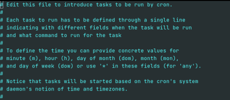

## h3-cli: How to schedule recurring pentests using h3-cli and `cron`

You can wire up h3-cli to a job scheduler (eg. `cron` ) in order to run pentests on a recurring basis. 
This guide shows you how to configure `cron` to automatically kick off a pentest once a week.

> `cron` is just one of many job scheduling services you could use for this purpose.  Any service is

compatible with this guide as long as you can invoke a shell script from it.

[[_TOC_]]

## Initial setup 

First set the `H3_API_KEY` and `H3_CLI_HOME` variables in your environment. `H3_CLI_HOME` should be set
to the full path of the `h3-cli` root directory.

```shell
export H3_CLI_HOME=/path/to/h3-cli
export H3_API_KEY="your-key-here"
```

> **NOTE**: Substitute `/path/to` in all examples with the actual path in your filesystem.

These environment variables are needed by the `cron` job as well.  Easiest way to do that is to write 
the lines above to a file.  Later we'll configure `cron` to load the variables from that file.

## Running a pentest

The script [start_pentest.sh](../scripts/start_pentest.sh) is an example shell script that:

1. provisions a new pentest 
2. writes the pentest's `op_id` to a temp file (`$H3_CLI_HOME/.h3-cli.op_id`)
    - this file is read by other shell scripts in this guide to retrieve the `op_id`
3. downloads and runs NodeZero™ (if it's an internal pentest)

Note that if you're running _internal_ pentests, you must download and run NodeZero 
as part of the `cron` job (step 3 above).  This means [start_pentest.sh](../scripts/start_pentest.sh) must be 
invoked on the machine where you intend to run NodeZero.

### Wiring up `start_pentest.sh` to `cron`

You can wire up [start_pentest.sh](../scripts/start_pentest.sh) to a job scheduling service like `cron` in order to run pentests on a recurring basis.

The commands below show how to conifgure `cron` to run [start_pentest.sh](../scripts/start_pentest.sh) every Friday at 6PM.

1. Open `crontab` for editing:
   
    ```shell
      crontab -e
      ```
   
   This will open a document (typically) in a [Vim](https://www.vim.org/) text editor that will either be empty or will contain lines of text outlining the purpose/use of the file you just opened, each beginning with a single `#` sign: 
   
   

   By convention, lines in this file beginning with a `#` are interpreted as "comments" and are ignored.

   A newcomer to Vim will notice that attempting to edit this file in its current state by normally typing won't work. 
   This is because Vim opens files in `normal` mode by default, which doesn't allow for direct text editing.

   In order to actually edit this crontab file, we'll need to enter Vim's `insert` mode.

2. Enter into Vim's `insert` mode by pressing `i`.
   
   After pressing `i`, you'll notice that typing regularly now actually inserts text.

3. Add the following line to the crontab file while in Vim's `insert` mode:
   
   ```shell
    0 18 * * 5 . /path/to/.env; /path/to/start_pentest.sh >> /path/to/output.log 2>&1
   ```

    This line can seem daunting to someone who's never seen a cron expression before or is new to working in a terminal. 
    We can break the above line down into three distinct sections:

    1. `0 18 * * 5` - The first five columns of the line define a [cron expression](https://docs.oracle.com/cd/E12058_01/doc/doc.1014/e12030/cron_expressions.htm).
    A cron expression specifies the _schedule_ for running the given commands. 
    Here, the first number specified the `minute` the crontab should run, the second number specified the `hour` the crontab should run, and the last number specifies the `day of the week` the crontab should run.
    So for this example, this cron expression translates to: "_Run every Friday at 6PM._"
    
    2. `. /path/to/.env; /path/to/start_pentest.sh` - There are the commands that the crontab will _execute_.
    The first command, `. /path/to/.env` will load the environment variables defined in `/path/to/.env` .
    This file must contain the `H3_API_KEY` and `H3_CLI_HOME` environment variables mentioned above.
    The second command runs the `/path/to/start_pentest.sh` shell script, which will provision and run the pentest.
        > **DON'T FORGET THE DOT!** The `.` command is equivalent to `source`. 
        It modifies the current environment with the settings read from `/path/to/.env`.
    
    3. `>> /path/to/output.log 2>&1` - This redirects the _output_ of the executed commands to a specific file on your filesystem.

    So the line we just inserted will cause `cron` to wake up every Friday at 6PM, run the given shell commands, and then write the output to `/path/to/output.log`.

4. Save your changes and exit the text editor. For Vim, this requires two quick steps:
   1. Press `esc` to exit `insert` mode and return back to `normal` mode.
   2. In `normal` mode, type: `:wq` (**w**rite and **q**uit) to save your changes and exit. 
   
   If everything worked, you should see something like `crontab: installing new crontab` as output.

For a quick reference on configuring `crontab` jobs, see [this article](https://www.adminschoice.com/crontab-quick-reference).
To verify the schedule for a given `crontab` expression, check out [this site](https://crontab.guru/).

## Pentest Active Windows

You may wish to pause and resume your pentest, for example around business hours, in order to minimize any
chance of disruption to your daily work. 

- The shell script [`pause_pentest.sh`](../scripts/pause_pentest.sh) checks the status of the pentest and pauses it if it is running.

- The shell script [`resume_pentest.sh`](../scripts/resume_pentest.sh) checks the status of the pentest and resumes it if it is paused. 

Note that the `op_id` is read from the temp `.h3-cli.op_id` file written by [`start_pentest.sh`](../scripts/start_pentest.sh).

### Wiring up Pause & Resume to `cron`

In this example we'll wire up `pause_pentest.sh` and `resume_pentest.sh` to `cron` such that the pentest 
is paused at the beginning of the work day (9AM) and resumed at the end of the work day (5PM).

Add the following lines to your `crontab` (via `crontab -e` ):

```shell
0 9 * * 1-5 . /path/to/.env; /path/to/pause_pentest.sh >>/path/to/output.log 2>&1
0 17 * * 1-5 . /path/to/.env; /path/to/resume_pentest.sh >>/path/to/output.log 2>&1
```

This `crontab` schedule will run `pause_pentest.sh` every weekday (Mon-Fri) at 9AM and `resume_pentest.sh`

every weekday at 5PM.

## Ending a pentest

Perhaps you only want the pentest to run over the weekend and if it's still running on Monday morning, 
you'd want to end it and view the results.  

This can be done by wiring up the [`cancel_pentest.sh`](../scripts/cancel_pentest.sh) shell script to `cron` :

```shell
0 8 * * 1 . /path/to/.env; /path/to/cancel_pentest.sh >>/path/to/output.log 2>&1
```

This `crontab` schedule will run `cancel_pentest.sh` on Mondays at 8AM.

> _Canceling_ a pentest will fully shut it down.  The results of the pentest are still recorded, up to the time 
> it is canceled, and will be reported in Portal. **None** of the pentest's data is deleted/purged in any way.

## Common `cron` issues

#### ERROR: sysctl: command not found

A common issue you might encounter is the `PATH` environment variable used by `cron` is different than your login 
session, in which case it may not be able to find certain commands, eg. `sysctl` .  You can fix this by setting the `PATH`

directly in the `cron` expression:

```shell
0 18 * * 5 export PATH=$PATH:/usr/local/bin:/usr/sbin; . /path/to/.env; /path/to/start_pentest.sh >>/path/to/output.log 2>&1
```

> You could also set the `PATH` in `/path/to/.env` , instead of directly in the `cron` expression.

#### ERROR: Authentication failed. Please make sure the token is still valid.

This usually means Docker was unable to store the credentials it uses to log in to the Docker registry containing the image 
for NodeZero.  

On MacOS, this can usually be corrected by removing `"credsStore": "desktop"` or `"credsStore": "osxkeychain"` from your
Docker `config.json` , which is typically found at `$HOME/.docker/config.json` .  

For other operating systems, you may need to remove `$HOME/.docker/config.json` entirely, and restart Docker. For more information 
about the error, search: "Docker Error saving credentials: error storing credentials - err: exit status 1, out: Write permissions error"

#### ERROR: The path is not shared and is not known to Docker.

Based on your Docker configuration, you may need to run NodeZero in a specific directory where Docker has permission to mount volumes
to the host filesystem.  By default `cron` launches jobs within the `$HOME` directory.  

To run the `cron` job in a different directory, simply `cd` to that directory in the `cron` expression.

```shell
0 18 * * 5 cd /run/from/here; . /path/to/.env; /path/to/start_pentest.sh >>/path/to/output.log 2>&1
```

#### Killing a `cron` job

A `cron` job ends when the command(s) it executes ends.  If you have a "runaway" `cron` job, you can terminate it
by killing the process it started. 

To kill a process started by `cron` , you must find it using `ps` and then `kill` it:

```shell
ps aux | grep start_pentest     # find the PID
kill -9 {pid}
```

> `ps` arguments vary by system.
